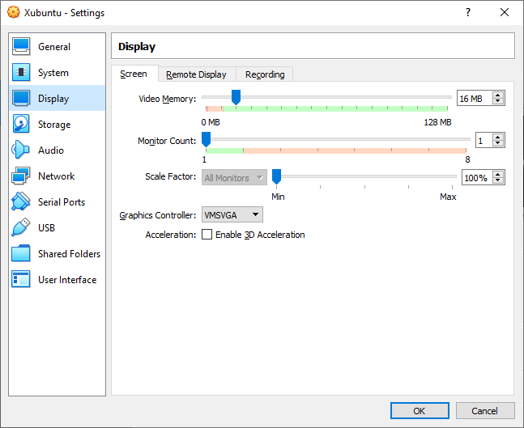

# Prerrequisitos

### Introducción

Antes de que podamos continuar, debemos configurar un entorno de desarrollo.

Si ya está utilizando **MacOS** o **Linux**, puede omitir esta sección. De lo contrario, haga clic en la flecha pequeña a la izquierda del método que le gustaría usar a continuación para expandir esa sección y luego siga las instrucciones de instalación.

#### Importante

Este plan de estudios solo admite el uso de una computadora portátil, computadora de escritorio o Chromebook compatible. No podemos ayudarlo a configurar un entorno de desarrollador en una RaspberryPi o cualquier otro dispositivo.

### Máquina virtual \(recomendado\)

La instalación de una máquina virtual \(VM\) es la forma más fácil y confiable de comenzar a crear un entorno para el desarrollo web. Una máquina virtual es una emulación de computadora completa que se ejecuta dentro de su sistema operativo \(SO\) actual, como Windows. El principal inconveniente de una máquina virtual es que puede ser lenta porque básicamente está ejecutando dos computadoras al mismo tiempo. Haremos algunas cosas para mejorar su rendimiento.

#### Paso 1: Descarga VirtualBox y Xubuntu

La instalación de una máquina virtual es un proceso sencillo. Esta guía utiliza el programa VirtualBox de Oracle para crear y ejecutar la VM. Este programa es de código abierto, gratuito y sencillo. Qué más se puede pedir? Ahora, asegurémonos de tener todo descargado y listo para la instalación.

#### Importante

Una vez que haya completado estas instrucciones, se espera que trabaje por completo en la VM. Maximice la ventana, agregue más monitores virtuales si los tiene, inicie el navegador de Internet en el menú Whisker en la parte superior izquierda del escritorio. No debe usar nada fuera de la VM mientras trabaja en Codelibro. Si siente que tiene un buen conocimiento después de usar la máquina virtual por un tiempo, y / o desea mejorar su experiencia, le recomendamos Ubuntu de arranque dual, para lo cual hay instrucciones a continuación.

#### Paso 1.1: Descarga VirtualBox

[Haga clic aquí](https://translate.google.com/translate?hl=en&sl=en&tl=es&u=https%3A%2F%2Fwww.virtualbox.org%2Fwiki%2FDownloads) y descargue VirtualBox para hosts de Windows.

#### Paso 1.2: Descarga Xubuntu

Hay miles de distribuciones de Linux, pero Ubuntu es sin duda una de las más populares y fáciles de usar. Al instalar Linux en una máquina virtual, recomendamos descargar [Xubuntu 18.04](https://mirror.us.leaseweb.net/ubuntu-cdimage/xubuntu/releases/18.04/release/xubuntu-18.04.5-desktop-amd64.iso). Xubuntu usa el mismo software base que Ubuntu pero tiene un entorno de escritorio que requiere menos recursos informáticos y, por lo tanto, es ideal para máquinas virtuales.

#### Paso 2: Instale VirtualBox y configure Xubuntu 

#### Paso 2.1: Instalar VirtualBox 

Instalar VirtualBox es muy sencillo. No requiere mucho conocimiento técnico y es el mismo proceso que instalar cualquier otro programa en su computadora con Windows. Al hacer doble clic en el archivo de VirtualBox descargado, se iniciará el proceso de instalación. Durante la instalación, se le presentarán varias opciones. Déjelos en su estado predeterminado a menos que esté seguro de su comportamiento. A medida que se instala el software, es posible que la barra de progreso parezca bloqueada; solo espera a que termine.

#### Paso 2.2: Prepare VirtualBox para Xubuntu

Ahora que tiene VirtualBox instalado, inicie el programa. Una vez abierto, debería ver la pantalla de inicio.

Haga clic en el botón "Nuevo" para crear un sistema operativo virtual. Asígnele un nombre de "Xubuntu", deje la "Carpeta de la máquina" como está, configure el "Tipo" en "Linux" y asegúrese de que la "Versión" esté configurada como "Ubuntu \(64 bits\)". Continúe presionando “Siguiente” y elija las siguientes opciones en los siguientes pasos:

Tamaño de la memoria: utilice 2048 MB o más si es posible. Idealmente, esta cantidad debería ser aproximadamente la mitad de la memoria máxima de su computadora. Por ejemplo, si tiene 8 GB de RAM, asigne 4096 MB \(1024 MB a 1 GB\) al sistema operativo de su VM. Si no sabe cuánta RAM tiene disponible, [haga clic aquí](https://www.xataka.com/basics/como-saber-cuanta-ram-tiene-tu-pc).

Disco duro: haga clic en "Crear un disco duro virtual ahora".

Tipo de archivo de disco duro: elija la opción VDI \(imagen de disco de VirtualBox\).

Almacenamiento en disco duro físico: "Asignado dinámicamente".

Ubicación y tamaño del archivo: recomendamos **al menos 20 GB** para el disco duro virtual.

Después de completar el último paso, haga clic en el botón "Crear". Su nuevo sistema operativo virtual debería aparecer ahora en el menú. Con Xubuntu seleccionado, haga clic en el botón "Configuración" en la barra de navegación, resaltado en rojo a continuación.

Haga clic en la pestaña "Sistema" y luego en la pestaña "Procesador". Aumente el \(los\) procesador \(es\) a 2. Si esta pantalla le impide aumentar los procesadores, es probable que deba [habilitar la virtualización en la configuración de BIOS / UEFI](https://www.google.com/search?q=enable+virtualization+windows) de su computadora. Si tiene un procesador de un solo núcleo, no podrá cambiar esta configuración.

Si tiene más de un monitor, puede crear monitores adicionales aumentando el atributo "Monitor Count" en la pestaña "Display". Asegúrese de aumentar el control deslizante "Memoria de video" hasta que esté en verde. Todas las demás configuraciones deben permanecer predeterminadas.

Con todo eso completo, haga clic en "Aceptar" para guardar los cambios.

No puede instalar Xubuntu sin montar la ISO que descargó anteriormente. Lo haremos ahora. Haga clic en la sección etiquetada \[Optical Drive\] Empty a la derecha del texto etiquetado IDE Secondary Master en Storage en la pantalla principal de VirtualBox, mientras Xubuntu está seleccionado. Esto abrirá un menú desplegable, haga clic en Elegir / Crear una imagen de disc...

En la siguiente ventana que se abre, haga clic en el Círculo azul con el Green Plus etiquetado Agregar y busque el archivo ISO de Xubuntu que descargó anteriormente. Elija la ISO y haga clic en abrir.

Ahora debería ver la ISO en la pantalla Selector de disco. Haga clic en él y presione el botón Seleccionar en la parte inferior.

Ahora puede iniciar la máquina virtual haciendo clic derecho en el icono en el menú y haciendo clic en la flecha grande "Inicio" en la parte superior.

Cuando se inicie la VM, se le pedirá que instale Xubuntu. Todas las opciones predeterminadas se pueden dejar solo, incluido el tipo de instalación \("Borrar disco e instalar Ubuntu"\). Puede parecer peligroso, pero la máquina virtual solo puede ver el "disco duro" de la máquina virtual. Esta es la belleza de las VM: la capacidad de separar el espacio físico de su computadora en muchas VM. Durante la instalación, asegúrese de tomar nota de la contraseña y el nombre de usuario que eligió, los necesitaremos más adelante.

El resto de la instalación es bastante sencilla, pero si tiene alguna pregunta, puede encontrar la guía de instalación oficial de Ubuntu para Ubuntu [aquí](https://translate.google.com/translate?hl=en&sl=en&tl=es&u=https%3A%2F%2Ftutorials.ubuntu.com%2Ftutorial%2Ftutorial-install-ubuntu-desktop%230).

#### Paso 3: Instalar y habilitar las Guest Additions 

Su sistema operativo habitual \(Windows en este caso\) se llama Host, y todos los demás sistemas operativos que se ejecutan como VM se denominan Invitados. Para facilitar el trabajo en su sistema operativo invitado, debe instalar Guest Additions. Agrega funcionalidad útil al sistema operativo invitado, como el modo invitado de pantalla completa.

Mientras su VM se está ejecutando, siga los siguientes pasos:

1. Haga clic en el menú Bigote en la parte superior izquierda del escritorio.
2. Escriba `Software Updater` en el campo de texto que se abre y haga clic en el elemento con el mismo nombre.
3. Instale todas las actualizaciones disponibles. Si no hay actualizaciones disponibles, continúe con el Paso 5.
4. Si el Software Updater está atascado esperando a que finalice una actualización desatendida, reinicie la VM y comience de nuevo desde el Paso 1.
5. Abra una terminal con `ctrl + alt + t` to abriendo el menú Whisker y escribiendo Terminal \(el atajo es obviamente más rápido\).
6. Copie y pegue esto en la terminal: `sudo apt install linux-headers-$(uname -r) build-essential dkms`. Ingrese su contraseña cuando se le solicite. \(nota: Su contraseña no será visible en la terminal. Esta es una característica de seguridad para proteger su contraseña. Presione `Enter` cuando termine\).
7. Si recibe los siguientes errores: "Unable to locate package build-essential**"** y "Unable to locate package dkms**"**, pegue lo siguiente:  `sudo apt-get install build-essential` y ingrese su contraseña. De lo contrario, continúe con el Paso 8.
8. Escribe `Y` cuando te lo pida y deja que termine de instalarse. Cierre la terminal cuando haya terminado
9. Haga clic en Dispositivos en la barra de herramientas de VM -&gt; Insertar imagen de CD de adiciones de invitado en la barra de menú.
10. Espere a que se monte la imagen del CD, mostrará el CD en el escritorio como sólido, no transparente, y se mostrará una ventana en la parte superior derecha de la pantalla de la VM que dice que se montó correctamente.
11. Haga doble clic en el icono del CD en el escritorio de la VM.
12. En la nueva ventana que se abre, haga clic con el botón derecho en el espacio en blanco o en cualquier archivo / carpeta y haga clic en "Open Terminal Here".
13. En la ventana de terminal recién abierta, pegue `sudo ./VBoxLinuxAdditions.run` y presione `enter`.
14. Una vez que termine, cierre el terminal y la carpeta del CD.
15. Haga clic con el botón derecho en CD en el escritorio de la VM y haga clic en Expulsar volumen. No se expulsará si la carpeta del CD está abierta. 
16. Reinicie su VM \(lo que puede hacer escribiendo reiniciar y presionando `enter` en una terminal\).
17. Ahora puede maximizar la ventana de la VM, utilizar el portapapeles compartido y crear pantallas adicionales, entre muchas otras funciones útiles. Estas opciones están disponibles en la barra de herramientas de VM en Ver y Dispositivo.

**Nota:**

* Si al intentar iniciar la VM solo aparece una pantalla negra, cierre y "apague" la VM, haga clic en "Configuración -&gt; Pantalla" y asegúrese de que "Habilitar la aceleración 3D" no esté MARCADO y que la memoria de video esté configurada en AL MENOS 128 MB.
* Si recibe un error al intentar montar la imagen del CD Guest Additions \("No se puede insertar el disco óptico virtual"\), reinicie el sistema operativo de su host \(Windows / OSX\). Luego, asegúrese de que no haya ningún archivo de imagen montado tanto en Virtual Box como en el sistema de archivos de la VM.
* Si encuentra el error "VirtualBox-Error: No se pudo abrir una sesión para la máquina virtual ...", es posible que deba activar la "virtualización" en la configuración del BIOS de su host. Si está utilizando Windows como su sistema operativo host, puede seguir estas instrucciones; de lo contrario, busque en Google cómo activarlo para su sistema operativo específico.

#### Paso 4: Comprenda su nueva máquina virtual

A continuación, se ofrecen algunos consejos que le ayudarán a empezar en un entorno virtual:

* Todo su trabajo debería ocurrir en la VM. Instalará todo lo que necesita para la codificación, incluido su editor de texto, Ruby y Rails dentro de la VM. La instalación de Xubuntu dentro de su VM también viene con un navegador web preinstalado.
* Para instalar software en su VM, deberá seguir las instrucciones de instalación de Ubuntu desde el interior de la VM de Xubuntu.
* Todo el desarrollo que harás relacionado con TOP se realizará en la VM.
* Recomendamos ir a pantalla completa \(Editar&gt; Modo de pantalla completa\) y olvidarse de su sistema operativo host \(Windows\). Para un mejor rendimiento, cierre todos los programas dentro de su sistema operativo host cuando ejecute su VM.
* Si agregó monitores adicionales en la pestaña "Pantalla" de la configuración de su VM, con la VM en ejecución, haga clic en "Ver" -&gt; "Pantalla virtual 2" -&gt; "Habilitar". Puede ejecutar la pantalla completa con varios monitores, pero puede solicitar más "Memoria de vídeo", que debería haber aumentado al agregar más monitores. Al salir de la pantalla completa, es posible que se cierre la pantalla secundaria. Puede volver a abrirlo con estas instrucciones.

### Arranque dual de Ubuntu / Windows

**Lea toda esta sección antes de comenzar**

El arranque dual proporciona dos sistemas operativos en su computadora entre los que puede cambiar con un simple reinicio. Un sistema operativo no modificará al otro a menos que le indique explícitamente que lo haga. Antes de continuar, asegúrese de hacer una copia de seguridad de todos los datos importantes y de tener una forma de pedir ayuda. Si se pierde, se asusta o se atasca, estamos aquí para ayudarlo en la [sala de chat de Codelibro](https://app.element.io/#/room/#codelibro:matrix.org). Ven a decir "Hola"!

#### Paso 1: Descarga Ubuntu

Primero, debe descargar la versión de Ubuntu que desea instalar en su computadora. Ubuntu viene en diferentes versiones \("sabores"\), pero sugerimos el estándar [Ubuntu](https://translate.google.com/translate?hl=en&sl=en&tl=es&u=https%3A%2F%2Fwww.ubuntu.com%2Fdownload%2Fdesktop). Si está utilizando una computadora más antigua, le recomendamos [Xubuntu](https://translate.google.com/translate?hl=en&sl=en&tl=es&u=https%3A%2F%2Fxubuntu.org%2F). Asegúrese de descargar la versión de 64 bits de [Ubuntu](https://www.ubuntu.com/download/desktop/thank-you?version=18.04.1&architecture=amd64) o [Xubuntu](http://ftp.ussg.iu.edu/linux/xubuntu/18.04/release/xubuntu-18.04.3-desktop-amd64.iso).

#### Paso 2: Cree una unidad flash de arranque

A continuación, siga esta [guía](https://translate.google.com/translate?hl=en&sl=en&tl=es&u=https%3A%2F%2Ftutorials.ubuntu.com%2Ftutorial%2Ftutorial-create-a-usb-stick-on-windows%230) para crear una unidad flash de arranque para que pueda instalar Ubuntu en su disco duro. Si no tiene una unidad flash, también puede usar un CD o DVD.

Nota: Puede utilizar este método para probar [diferentes versiones de Ubuntu](https://translate.google.com/translate?hl=en&sl=en&tl=es&u=https%3A%2F%2Fwww.ubuntu.com%2Fdownload%2Fflavours) si lo desea. Estas imágenes le permiten probar diferentes sabores sin comprometerse con una instalación. Tenga en cuenta que ejecutar el sistema operativo desde una unidad flash hará que el sistema operativo sea lento y puede reducir la vida útil de su unidad flash.

#### Paso 3: Instala Ubuntu

#### Paso 3.1: Arranque desde la unidad flash

Primero, necesita iniciar Ubuntu desde su unidad flash. Los pasos exactos pueden variar, pero en general, deberá hacer lo siguiente:

* Inserte la unidad flash en la computadora.
* Reinicia la computadora.
* Seleccione la unidad flash como dispositivo de arranque en lugar del disco duro.

Por ejemplo, en una computadora Dell, necesitaría conectar la unidad flash, reiniciar la computadora y presionar la tecla F12 mientras la computadora se inicia por primera vez para que aparezca el menú de inicio. Desde allí, puede seleccionar arrancar desde la unidad flash. Es posible que su computadora no sea exactamente la misma, pero Google puede ayudarlo a resolverlo.

#### Paso 3.2: Instale Ubuntu

Si desea probar la versión de Ubuntu en la unidad flash, haga clic en "Probarme". Cuando haya encontrado un sabor de Ubuntu que le guste, haga clic en "Instalar" y continúe con el siguiente paso.

La instalación de Ubuntu es donde comienzan a ocurrir los cambios reales en su computadora. La configuración predeterminada es en su mayoría perfecta, pero asegúrese de "**Instalar Ubuntu junto con Windows**" y cambiar el espacio de disco asignado permitido para Ubuntu a 30 GB \(o más si puede\).

Para obtener instrucciones paso a paso, siga esta [guía de instalación](https://translate.google.com/translate?hl=en&sl=en&tl=es&u=https%3A%2F%2Ftutorials.ubuntu.com%2Ftutorial%2Ftutorial-install-ubuntu-desktop%230) de los creadores de Ubuntu.

### Chrome OS / CloudReady

Con la reciente incorporación de Linux \(Beta\), la plataforma Chrome OS se ha abierto a la capacidad de instalar aplicaciones nativas de Linux. Si desea utilizar su Chromebook para completar El Proyecto Odin, deberá asegurarse de cumplir con un par de requisitos:

1. Tienes una [Chromebook compatible](https://translate.google.com/translate?hl=en&sl=en&tl=es&u=https%3A%2F%2Fwww.chromium.org%2Fchromium-os%2Fchrome-os-systems-supporting-linux)
2. Puede instalar [Linux \(Beta\)](https://translate.google.com/translate?hl=en&sl=en&tl=es&u=https%3A%2F%2Fsupport.google.com%2Fchromebook%2Fanswer%2F9145439%3Fhl%3Den)

Una vez que haya cumplido con éxito estos dos requisitos, debería poder seguir las instrucciones de Linux a lo largo de todo el plan de estudios.

**Nota para los usuarios de CloudReady**

Actualmente hay un error que impide que CloudReady v83.4 instale Linux \(Beta\) con éxito. Esto se resolvió en la versión 85.2.

**Una nota para aquellos que se preguntan por qué se les pide que instalen un sistema operativo completamente nuevo.**

Por qué todos los que vienen a Codelibro están "obligados" a cambiar a Linux o macOS para el desarrollo? No hay desarrolladores web que utilicen Windows como su sistema operativo principal?

Una de las razones es que Ruby \(on Rails\) y Node.js, tecnologías de backend populares enseñadas por Codelibro y ampliamente utilizadas en la comunidad de desarrollo web más grande, son proyectos de código abierto que esperan explícitamente ejecutarse en un código abierto \(basado en UNIX \) plataforma. Y aunque todos los sistemas operativos de Apple han incluido el kernel XNU, originalmente basado en la versión [FreeBSD de UNIX](https://translate.google.com/translate?hl=en&sl=en&tl=es&u=https%3A%2F%2Fwww.freebsd.org%2F) desde la transición de System 9 a Mac OS X en 2001, Microsoft se ha comprometido recientemente a adoptar el código abierto y brindar más soporte a la gente. enfoque el desarrollo web hoy.

Una de las características más importantes agregadas en Windows 10 fue el Subsistema de Windows para Linux \(WSL\), que es una línea de comandos de Linux dentro de Windows. Sin embargo, configurar un entorno de desarrollo dentro de WSL no es amigable para los principiantes, por lo que Codelibro elige no recomendar y / o apoyar este enfoque. Todas las instrucciones que encuentre aquí supondrán que está ejecutando MacOS o Linux. El uso de WSL con estas instrucciones puede causar problemas que no podemos ayudarlo a resolver.

Tenemos un gran soporte para Linux / MacOS si te atascas, así que inténtalo! Si cree que puede contribuir y apoyar a Windows en Codelibro, cree una [pull request](https://github.com/wbnns/codelibro) con las instrucciones de instalación de Windows y arreglos para cualquier lugar donde los comandos de Windows puedan diferir de Linux.

